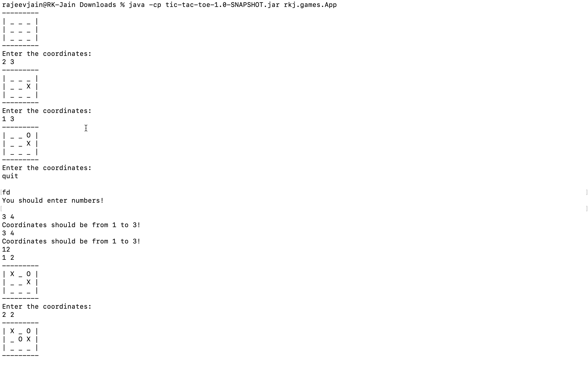

# tic-tac-toe

This is a simple offline 2-player game you can play in your terminal. 

## Steps to play the game:

First download the game by downloading [this](https://github.com/Rohitesh-Kumar-Jain/tic-tac-toe/blob/master/target/tic-tac-toe-1.0-SNAPSHOT.jar) file.

After downloading that file, open your terminal, and change your directory to downloads (or where ever you downloaded it).

Now run this command on your terminal.

`Downloads % java -cp tic-tac-toe-1.0-SNAPSHOT.jar rkj.games.App`

Enjoy the game :P and suggest improvements and report bugs in the issues.

